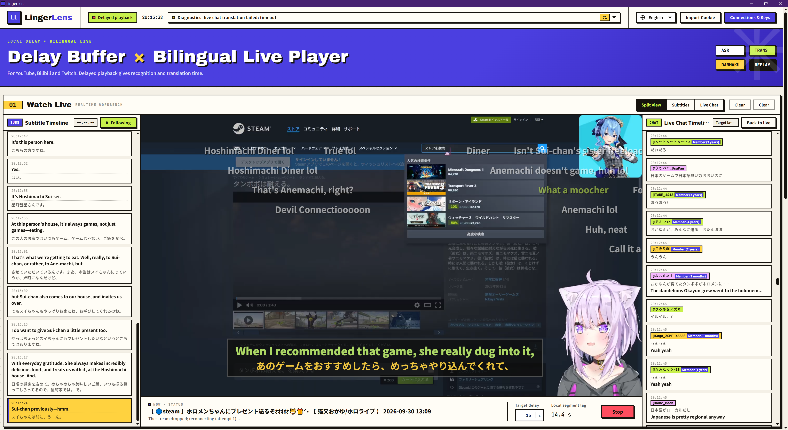
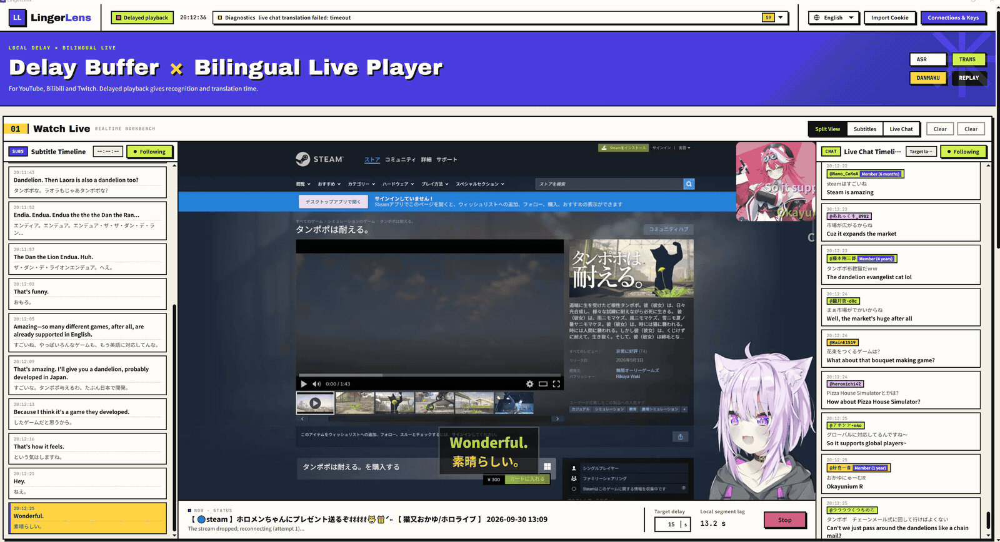

<p align="center"></p>
<h1 align="center">LingerLens</h1>
<p align="center"><strong>約15秒の遅延で、より安定した、文脈のある読みやすい翻訳字幕を。</strong></p>

[English](README.md) · [简体中文](README.zh-CN.md) · [日本語](README.ja.md) · [Deutsch](README.de.md) · [Русский](README.ru.md)

LingerLens は **YouTube、Bilibili、Twitch に対応した二言語ライブプレーヤー**です。音声翻訳、ライブチャットの翻訳、翻訳したコメントの弾幕表示で、外国語の配信を追いやすくします。

リアルタイム翻訳は字幕を早く表示する一方、話し終わる前の不完全な文から認識・翻訳結果を出します。続きの音声が届くたびに字幕が追加・修正され、ときには文全体が書き換わります。この **字幕のちらつき・頻繁な書き換え（subtitle flickering / revision churn）**により、同じ行を読み直す必要が生じ、視聴が途切れます。

LingerLens は映像を約 **15秒**バッファリングし、音声認識、文の分割、翻訳に時間を確保してから、再生タイムラインに沿って二言語字幕を表示します。一時的な結果の書き換えを減らし、対応する映像とともに、より安定した文脈のある訳文を読めるようにします。**遅延は調整可能で、翻訳したライブチャットを映像上に弾幕として表示することもできます。**



## 動作デモ

英語画面での二言語字幕、遅延再生、ライブチャットのデモです。



## ダウンロード

[**GitHub Releases →**](https://github.com/Antiranger/LingerLens/releases)

Windows x64 は `.exe`、Mac は Apple Silicon 用の `macos-arm64.dmg` または Intel 用の `macos-x64.dmg` を選びます。DMG を開き、LingerLens を「アプリケーション」にドラッグしてください。公開済み Release の添付ファイルが配布対象です。Windows 版は未署名です。macOS 版は整合性確認用のアドホック署名済みですが、Apple Developer ID 署名と公証はありません。`SHA256SUMS.txt` でダウンロードを確認できます。

## 映像を遅らせる理由

遅延再生より先に認識と翻訳を処理します。初期目標は15秒、設定範囲は11～60秒です。配信元・通信・サービスにも左右されるため、一定の総遅延を保証するものではありません。長い発話は分割され、単語の時刻情報がないサービスでは概算の区間を使います。字幕の書き換えを減らしますが、すべての訳文の到着時刻や正確さを保証するものではありません。

## 主な機能

- ローカル HLS の遅延再生。目標は初期値 15 秒、設定範囲は 11～60 秒です。実際の遅延には配信元とネットワークも影響します。
- 原文と訳文の字幕。認識サービスが話者情報を返す場合、重なった発話も表示できます。
- 認識・翻訳・代替モデルの設定、任意のチャット翻訳、必要な情報が得られる場合の利用量・料金見積もり。
- 位置とスタイルを保存できる字幕ウィンドウ、プレーヤー全体の全画面表示、診断記録、更新確認。
- 簡体字中国語、英語、日本語、ドイツ語、ロシア語の画面表示。画面と字幕の言語は別々に設定します。

## 使い始める

お使いの OS に合うパッケージをインストールし、**LingerLens** を開きます。Electron、Python、FFmpeg/ffprobe、yt-dlp、フォント、日本語辞書を同梱し、開発ツールは不要です。クラウド認識・翻訳にはネット接続、ご自身の API キー、サービス利用料が必要です。ローカル Whisper サーバーとモデルは含まれません。

設定の詳細は[日本語ガイド](docs/ja/guide.md)、Windows・macOS のビルド方法は[デスクトップ文書](desktop/README.md)を参照してください。

1. 接続先と API キーの設定を開き、認識・翻訳サービスを登録します。
2. 配信の言語と翻訳先を選び、必要に応じて字幕を有効にします。
3. 配信 URL を貼り付け、画質を取得して、対応形式で再生します。
4. ログインが必要な場合だけ Cookie を取り込みます。アカウント変更や更新の前には再生を停止してください。

[日本語ガイド](docs/ja/guide.md)に、設定、Cookie、プライバシー、問題の切り分け、開発手順をまとめています。

## ソースから実行する

Windows、Python **3.11 以上**、Node.js **22.12 以上**、PATH 上の FFmpeg/ffprobe、Chrome または Edge が必要です。

```powershell
git clone https://github.com/Antiranger/LingerLens.git
cd LingerLens
py -3.11 -m venv .venv
.\.venv\Scripts\Activate.ps1
powershell.exe -NoProfile -ExecutionPolicy Bypass -File .\bootstrap.ps1 -Python .\.venv\Scripts\python.exe
.\start-lingerlens.cmd -Prototype -Python .\.venv\Scripts\python.exe
```

<http://127.0.0.1:8765/> を開きます。Bootstrap はツールと yt-dlp のチェックサムを確認して依存関係をインストールします。`-CheckOnly` なら確認のみです。デスクトップ版のビルドは行いません。

`-Prototype` を付けない起動コマンドは、既存の `release/win-unpacked/LingerLens.exe` を開きます。[ビルド手順](desktop/README.md)も参照してください。

## モデルの設定

認識プロトコルを選び、推奨モデルからIDを入力するか、手動で指定します。Tencentでは認識エンジンも更新されます。サービス内蔵の二言語モードは1つの接続で認識と翻訳を行い、その他のモードでは翻訳サービスを別に設定します。[サービス設定](docs/PROVIDERS.md)と[ASR時刻の互換性](docs/ASR-COMPATIBILITY.md)を参照してください。

## 更新

Windowsのインストール版はGitHub Releasesで更新を確認します。利用者の操作で新版をダウンロードし、サイズとSHA-256を検証してからインストーラーを実行します。ソース実行時は更新ボタンを表示しません。macOSは新版DMGでアプリを置き換えます。既存の設定は保持され、新規プロファイルには個人のモデル・APIキー・Cookieは含まれません。

## プライバシーと制限

クラウド認識には音声を、翻訳には文章と文脈を送信します。認識と翻訳を一体で行うサービスでは、同じ接続先が音声と翻訳指示を受け取ります。ローカルの Whisper 互換サービスは別途導入が必要で、ローカル認識を使ってもクラウド翻訳への送信は続きます。

キーと Cookie は通常のローカルファイルに保存され、暗号化された保管庫ではありません。**設定画面には保存済みのキーが表示されます。** 画面共有中は開かず、実行時データや未確認のログを Issue に添付しないでください。データは通常 `%APPDATA%/LingerLens` にあり、既定ではアンインストール後も残ります。

DRM、有料アクセス、アカウント制限、ボット対策を回避する機能はありません。サービス料金、サイトの変更、翻訳精度には個別の確認が必要です。オフラインテストはすべての実アカウントでの動作を保証しません。

## 開発と参加

変更前後に `npm run ci` と `git diff --check` を実行します。CI は文書、ライセンス、構文、ローカルテストを確認します。任意のブラウザー・Streamlink テストは依存関係がなければスキップされます。[開発文書](docs/DEVELOPMENT.md)を参照してください。

[文書一覧](docs/README.md) · [貢献方法](CONTRIBUTING.md) · [行動規範](CODE_OF_CONDUCT.md) · [サポート](SUPPORT.md) · [セキュリティ](SECURITY.md) · [変更履歴](CHANGELOG.md) · [リリース手順](docs/RELEASING.md)

アプリのコードは [MIT ライセンス](LICENSE) です。同梱ソフトウェアにはそれぞれのライセンスが適用されます。再配布の前に[第三者ソフトウェアの表示](THIRD_PARTY_NOTICES.md)と対応ソースの提供要件を確認してください。
