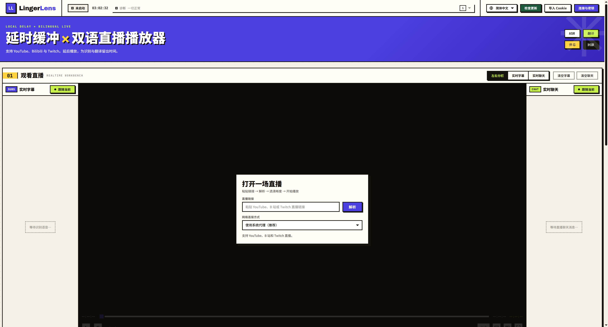

<p align="center"></p>
<h1 align="center">LingerLens</h1>
<p align="center"><strong>看直播，也看懂直播。</strong></p>

[English](README.md) · [简体中文](README.zh-CN.md) · [日本語](README.ja.md) · [Deutsch](README.de.md) · [Русский](README.ru.md)

给字幕留出一点时间，再看直播。LingerLens 将 **YouTube、哔哩哔哩、Twitch 直播**延迟后在本机播放，配合语音识别、双语字幕和直播聊天，让跨语言观看更方便。

**Windows 与 macOS 预览版 · 应用代码采用 MIT 许可证 · 模型服务需自备账户和密钥。** 平台及语言支持取决于直播、账户和所选服务。

[](https://github.com/Antiranger/LingerLens/actions/workflows/ci.yml) [](LICENSE)



## 下载

[**前往 GitHub Releases 下载 →**](https://github.com/Antiranger/LingerLens/releases)

| 系统 | 安装包 |
| --- | --- |
| Windows x64 | `LingerLens-<版本>-windows-x64-setup.exe` |
| macOS · Apple Silicon | `LingerLens-<版本>-macos-arm64.dmg` |
| macOS · Intel | `LingerLens-<版本>-macos-x64.dmg` |

实际可下载的平台以已发布 Release 附件为准。预览安装包尚未签名，macOS 包尚未公证。Mac 打开对应 DMG 后，将 LingerLens 拖入「应用程序」。可以使用 Release 中的 `SHA256SUMS.txt` 核对下载文件。

## 为什么要延迟画面？

语音识别和翻译需要时间。LingerLens 让画面稍等一会儿，让说话声和译文尽量一起到达。可以从默认的 15 秒目标延迟开始，再根据服务速度和网络状况调整。

## 功能

- 本地 HLS 延迟播放：默认目标为 15 秒，可设置为 11–60 秒。平台和网络延迟也会影响最终效果。
- 原文与译文字幕；识别服务提供说话人信息时，可同时显示重叠发言。
- 可配置识别、翻译和备用模型，支持可选的聊天翻译；数据充足时显示用量及费用估算。
- 可拖动并保存样式的字幕窗口、舞台全屏、诊断记录和桌面更新检查。
- 简体中文、英语、日语、德语、俄语界面。界面语言与字幕语言分别设置。

## 开始使用

安装对应系统的安装包后，打开 **LingerLens**。包内包含 Electron、Python、FFmpeg/ffprobe、yt-dlp、字体和日语词典，无需打开终端或另装开发工具。云端识别与翻译仍需联网、自备 API 密钥，并承担服务商费用。可选的本地 Whisper 服务及模型权重不随包提供。

详细配置见[中文使用指南](docs/zh-CN/guide.md)。Windows 和 macOS 的源码打包步骤见[桌面构建文档](desktop/README.md)。

1. 打开「连接与密钥」，填写自己的识别和翻译服务配置。
2. 选择直播原语言、字幕目标语言，按需启用字幕。
3. 粘贴直播链接，探测清晰度，选择兼容格式并开始播放。
4. 只有需要登录时才导入对应平台的 Cookie。更换账户或更新程序前先停止播放。

详细步骤见[中文使用指南](docs/zh-CN/guide.md)，包含模型、Cookie、隐私、故障处理和开发说明。

## 从源码运行

浏览器模式需要 Windows、Python **3.11+**、Node.js **22.12+**、PATH 中的 FFmpeg/ffprobe，以及 Chrome 或 Edge。仓库保持私有期间，克隆需要 GitHub 访问权限。

```powershell
git clone https://github.com/Antiranger/LingerLens.git
cd LingerLens
py -3.11 -m venv .venv
.\.venv\Scripts\Activate.ps1
powershell.exe -NoProfile -ExecutionPolicy Bypass -File .\bootstrap.ps1 -Python .\.venv\Scripts\python.exe
.\start-lingerlens.cmd -Prototype -Python .\.venv\Scripts\python.exe
```

打开 <http://127.0.0.1:8765/>。Bootstrap 会检查工具及 yt-dlp 校验和，再安装依赖；加 `-CheckOnly` 可只检查、不安装。它不会生成桌面程序。

不带 `-Prototype` 的启动命令会打开已有的 `release/win-unpacked/LingerLens.exe`。需要自行构建时，请看[桌面构建文档](desktop/README.md)。

## 隐私和使用边界

云端识别会发送直播音频；翻译会发送文字和上下文；原生双语模式可能由同一个服务接收音频并翻译。本地 Whisper 兼容服务需要另行部署；使用本地识别不意味着云端翻译也留在本地。

密钥和 Cookie 保存在本机普通文件中，并非加密凭据库。**「连接与密钥」会显示已保存的密钥**，共享屏幕时请关闭。不要上传运行目录或未经检查的诊断日志。桌面数据通常位于 `%APPDATA%/LingerLens`，默认卸载会保留数据。

程序不绕过 DRM、付费权限、账户限制或反爬机制。模型费用、站点变动和翻译质量仍需使用者留意；离线测试通过不代表所有真实账户和直播均已验证。

## 开发和参与

提交前运行 `npm run ci` 和 `git diff --check`。CI 检查仓库、文档、许可证、语法和本地测试；浏览器及 Streamlink 的可选测试可能因依赖缺失跳过，详见[开发与验证](docs/DEVELOPMENT.md)。

[五语文档](docs/README.md) · [贡献指南](CONTRIBUTING.md) · [行为准则](CODE_OF_CONDUCT.md) · [寻求帮助](SUPPORT.md) · [安全政策](SECURITY.md) · [更新记录](CHANGELOG.md) · [发布检查](docs/RELEASING.md)

应用代码采用 [MIT 许可证](LICENSE)。随附组件各自适用不同许可证，分发前请核对[第三方声明](THIRD_PARTY_NOTICES.md)及对应源码交付要求。
