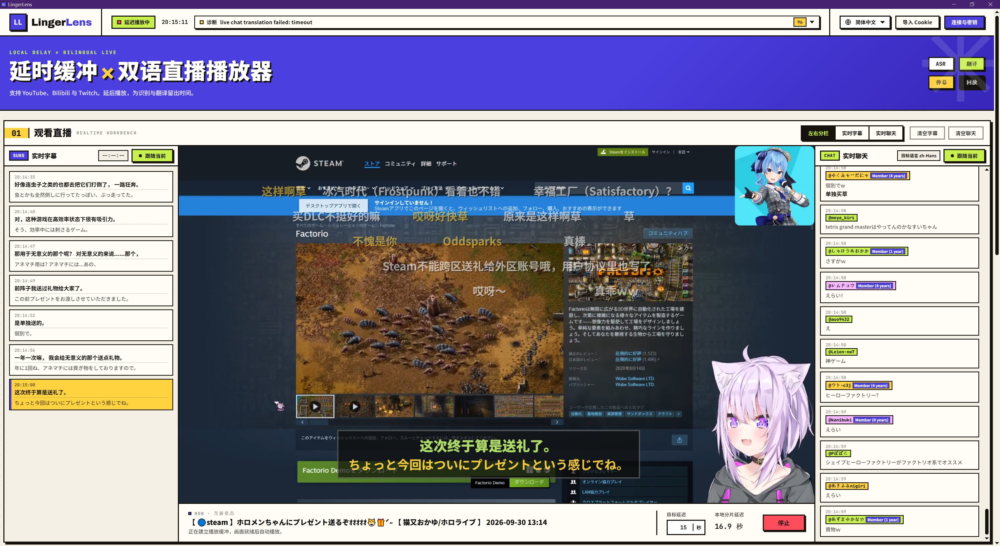
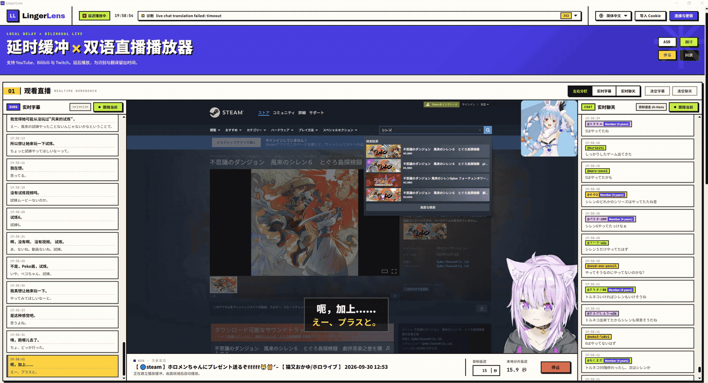

<p align="center"></p>
<h1 align="center">LingerLens</h1>
<p align="center"><strong>用约 15 秒的延迟，换取更稳定、完整、可读的直播翻译字幕。</strong></p>

<p align="center">
  <a href="https://github.com/Antiranger/LingerLens/releases">下载安装</a> ·
  <a href="docs/zh-CN/guide.md">使用指南</a> ·
  <a href="https://github.com/Antiranger/LingerLens/issues">反馈问题</a>
</p>

[English](README.md) · **简体中文** · [日本語](README.ja.md) · [Deutsch](README.de.md) · [Русский](README.ru.md)

LingerLens 是一款支持 **YouTube、Bilibili 和 Twitch 的双语直播播放器**，提供直播语音翻译、聊天翻译和翻译弹幕，让你更轻松地观看外语直播。

实时直播翻译通常追求尽快显示字幕，但一句话还没说完，识别和翻译模型就只能根据不完整的内容输出结果。随着后续语音到来，字幕会不断追加、修正，甚至整句改写。这种 **增量字幕抖动（subtitle flickering / revision churn）**，让观众不得不反复阅读同一句话，打断观看体验。

LingerLens 为直播画面加入约 **15 秒的延迟缓冲**，给语音识别、断句和翻译留出处理时间，再按播放时间轴显示双语字幕。它利用这段缓冲减少临时结果的反复变化，让你在看到对应画面时，读到更稳定、上下文更完整的翻译。**延迟可调，也支持将翻译后的直播聊天以弹幕形式叠加到画面中。**



## 观看演示

下面的 GIF 展示了中文界面下的直播播放、双语字幕和聊天弹幕。



## 主要功能

| 功能 | 你可以做什么 |
| --- | --- |
| 延迟缓冲 | 从默认 15 秒开始调整播放延迟，为识别和翻译留出时间。 |
| 双语字幕 | 同时阅读原文与译文，查看字幕时间轴，调整字幕位置和样式。 |
| 聊天翻译与弹幕 | 翻译直播聊天，在侧栏阅读，或以弹幕形式叠加到画面中。 |
| 模型选择 | 配置自己的 ASR 和翻译服务；支持服务原生双语模式，也可分别选择识别与翻译模型。 |
| 多语言界面 | 简体中文、英语、日语、德语、俄语；界面语言与字幕语言分别设置。 |

支持的服务包括 Soniox、千问、腾讯、豆包、Deepgram、OpenAI 等。选择 ASR 协议后，可从推荐模型下拉栏填写模型 ID，也可手动填写。具体协议与配置见[模型服务说明](docs/PROVIDERS.md)。

## 下载与安装

[**前往 GitHub Releases 下载 →**](https://github.com/Antiranger/LingerLens/releases)

| 系统 | 选择的安装包 | 安装方式 |
| --- | --- | --- |
| Windows x64 | `LingerLens-<版本>-windows-x64-setup.exe` | 运行安装向导，可选择安装目录。 |
| macOS · Apple Silicon | `LingerLens-<版本>-macos-arm64.dmg` | 打开 DMG，将应用拖入「应用程序」。 |
| macOS · Intel | `LingerLens-<版本>-macos-x64.dmg` | 打开 DMG，将应用拖入「应用程序」。 |

安装包包含 Electron、Python、FFmpeg/ffprobe、yt-dlp、字体和日语词典，**无需另装 Python、Node.js 或开发工具**。实际可下载的平台以 Release 附件为准。

云端识别与翻译需要你自己的服务账户和 API 密钥，相关费用由服务商收取。可选的本地 Whisper 服务及模型权重不包含在安装包内。

当前为早期版本，Windows 安装包尚未签名；macOS 包已进行本地签名以校验完整性，但没有 Apple Developer ID 签名和公证。Release 提供 `SHA256SUMS.txt`，可用于核对下载文件。

## 第一次使用

1. **配置模型。** 打开「连接与密钥」，添加 ASR 服务，选择协议和模型，填写自己的密钥。使用原生双语模式时，可由同一服务完成识别与翻译；其他模式需另外配置翻译服务。
2. **选择语言。** 设置直播原语言和字幕目标语言，启用需要的字幕、聊天翻译与弹幕显示。
3. **打开直播。** 粘贴 YouTube、Bilibili 或 Twitch 直播链接，探测清晰度，选择格式并开始播放。
4. **等待缓冲。** 从默认 15 秒目标延迟开始；如果译文经常晚于画面到达，可以适当增加延迟。

公开直播可先尝试直接播放；需要登录时，再通过「导入 Cookie」添加对应平台的登录信息。

模型配置、Cookie 导入、字幕样式和排错步骤见[中文使用指南](docs/zh-CN/guide.md)。

## 延迟缓冲如何工作？

```text
直播源 ──┬── 音频 → 语音识别 → 断句与翻译 → 字幕时间轴
         └── 视频 → 本地延迟缓冲 ──────────→ 播放画面
                                              ↑
                                  按播放时间轴显示对应字幕
```

识别与翻译在画面播放之前进行，缓冲为它们留出处理时间。字幕按直播时间轴安排显示，减少边听边猜、边看边改造成的阅读干扰。

15 秒是默认目标，当前可调整范围为 **11–60 秒**，并不代表固定的端到端延迟。平台、网络和模型速度都会影响实际效果；缓冲能减少字幕抖动，但不能保证每条译文都按时到达或完全准确。

不同 ASR 服务提供的时间信息也不同：词级时间戳可用于更细的对齐，缺少时间戳时使用近似区间。长句可能分段显示。实现细节见 [ASR 适配说明](docs/ASR-COMPATIBILITY.md)。

## 本地数据与更新

首次安装时，应用没有预置的私人模型配置、API 密钥或 Cookie。你添加的配置保存在本机，升级和重装默认保留已有用户数据。

| 系统 | 默认用户数据目录 |
| --- | --- |
| Windows | `%APPDATA%/LingerLens` |
| macOS | `~/Library/Application Support/LingerLens` |

云端 ASR 会将音频发送给所选服务，云端翻译会发送文字及必要上下文。密钥和 Cookie 保存在本地文件中，并非加密凭据库；录屏或共享屏幕时，请关闭会显示密钥的「连接与密钥」窗口。

Windows 安装版提供「检查更新」，从 GitHub Releases 获取版本信息。发现新版后，按用户操作下载安装包，核对文件大小和 SHA-256 后运行安装程序。源码运行模式隐藏此按钮。

也可以从 Releases 手动下载新版：Windows 运行安装程序；macOS 下载新版 DMG，替换应用。

## 常见问题

**为什么画面会晚一些？** 这是为识别和翻译预留的缓冲。LingerLens 适合希望读懂直播内容、可以接受一定观看延迟的场景。

**装好就能直接翻译吗？** 播放依赖已包含在安装包中，但云端翻译需要先配置自己的模型账户和密钥。模型支持的语言、额度和费用由服务商决定。

**没有字幕或译文怎么办？** 检查所选模型、密钥、服务额度和语言设置；有原文但没有译文时，检查翻译服务或原生双语模式。译文持续迟到时，尝试增加目标延迟。

**直播无法打开怎么办？** 检查直播是否仍在进行、所选格式是否兼容，以及是否需要登录。账户、地区或平台限制也可能影响播放；Cookie 不会绕过这些限制。

更多排错说明见[使用指南](docs/zh-CN/guide.md)，也可通过 [GitHub Issues](https://github.com/Antiranger/LingerLens/issues) 反馈。提交问题时，请勿附带密钥、Cookie 或未经检查的诊断日志。

## 开发与贡献

欢迎反馈观看体验、模型适配和平台兼容问题，也欢迎提交改进。

- [开发与验证](docs/DEVELOPMENT.md)：源码运行、测试与项目结构。
- [桌面构建](desktop/README.md)：Windows 与 macOS 打包步骤。
- [贡献指南](CONTRIBUTING.md)：提交 Issue 和 Pull Request。
- [更新记录](CHANGELOG.md) · [安全政策](SECURITY.md) · [行为准则](CODE_OF_CONDUCT.md)。

提交代码前运行 `npm run ci` 和 `git diff --check`。完整的五语文档入口见[文档目录](docs/README.md)。

## 许可证

LingerLens 应用代码采用 [MIT 许可证](LICENSE)。随附组件适用各自的许可证，详见[第三方声明](THIRD_PARTY_NOTICES.md)。
