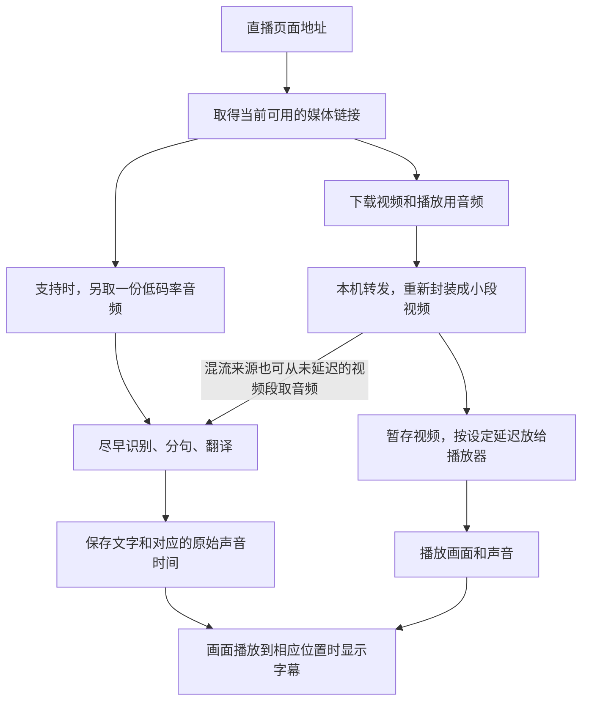

# 字幕性能、音视频下载与卡顿恢复：修复报告

日期：2026-09-20。基于 `wip/subtitle-anchor-correction` 分支、`65efeb4` 上的工作树。此前的五语文档、开源准备和识别服务改动予以保留；本文只记录本轮修复及验证。仓库没有公开，本轮没有提交、推送或发布。

后续：[延迟指标与调整建议修复](delay-metrics-fix-2026-09-20.md)进一步替换了本文提到的字幕预算粗估，并修正播放延迟、追赶播放和调整按钮。本文测试计数保留为当时结果；最新验证见后续报告。

**结论：现有下载架构可以继续使用，本轮修掉了几处会让播放恢复失效、停止不干净或字幕处理越来越费力的问题，并补上了有界的整场自动恢复。短暂断流先由重连和缓冲处理；下载进程退出、链接过期或封装卡死时，后台会重新解析并一起重建整场会话。**

## 1. 声音和画面现在怎么走

视频通常不重新压制，而是保留原有编码、换成播放器能连续读取的分段形式。这比把每帧重新编码省事，也节省处理器开销。代码中的主要工具分别是 yt-dlp（取得链接及下载）和 FFmpeg（媒体处理）。

给识别额外取一路低码率声音，会增加少量下载流量和一个任务，但能让视频下载的短暂阻塞不立即饿住字幕处理。不同路仍然依赖同一个上游和网络，因此这种拆分不等于完全独立的容灾。

声音与画面按来源自带的时间对齐，不能按“谁先下载到电脑”来对齐。也正因为如此，发生严重故障时，单独偷偷重启一路下载有风险：新声音的起点可能变了，旧字幕还留在原来的时间线上。

15 秒延迟是给识别和翻译争取的时间预算。它还会受到来源分段长度、网络、分句等待和服务耗时影响，不能当作任何直播都能保证的字幕完成期限。本轮没有靠增加默认延迟来掩盖问题。

## 2. 本轮实际修复

| 修复 | 原来的问题 | 现在的处理与效果 |
| --- | --- | --- |
| Soniox 的重复计算 | 已确认文字越积越多，每条后续消息还会重复处理整段历史；没有新文字的消息也如此 | 只累计新增内容，保留必要词尾及最终核对所需的信息；减少反复扫描 |
| 翻译连接复用 | 连续翻译不断建立新连接 | 每个翻译工作任务复用连接；请求仍有各自的期限，停止时关闭连接，账号和服务之间不共享 Cookie |
| 内置译文的保存与对应 | 部分终结路径没有回收历史；重新连接或原文拆句后可能误领译文 | 各写入路径统一限制为 256 条记录；区分连接代次；只领取原文匹配的完整段落译文 |
| 播放器恢复接线 | 正式调用的浏览器恢复函数没有导出，严重错误时会报“不是函数” | 补齐真实调用链；切换音频解码尝试后执行恢复动作 |
| 连续错误与迟到恢复 | 多个错误可能安排重复恢复；旧播放器的延迟操作可能干扰新播放器 | 一次只保留一个恢复动作，销毁时取消；真正恢复播放后撤销多余动作，持续播放后才恢复重试额度 |
| 单路断流判断 | 视频从来没有收到字节时，健康音频可能掩盖它 | 把从未收到数据的下载路也计入无进展时间 |
| 停止下载与启动失败清理 | 接收方不读数据时转发线程可能卡住；第二路启动失败可能留下第一路 | 主动关闭已连接的本机连接；启动失败统一清理已启动任务 |
| 启动、停止相互抢跑 | 启动尚未结束时点停止，或者启动请求被取消，后台工作可能随后继续启动 | 启停按顺序完成；等待并行启动结果后统一回滚；某个字幕或聊天清理出错，也继续清理媒体和凭据 |
| 旧字幕请求污染新会话 | 上一场直播的请求晚到，可能写入新字幕或推进新游标 | 前后端同时校验观看会话；后端换场而播放地址相同时，也重新接入播放器 |
| 字幕耗时统计 | 失败请求的结束时间可能被混进“成功译文准备时间” | 预算提示只取成功译文统计；无样本显示未知；分别记录原文和译文到达时的实际播放位置 |
| 字幕出现回退 | 原生翻译模式曾等 Provider 的结束事件，前端字幕轮询又可能额外等待 500ms | 恢复安全标点的实时分句，完整句先显示原文；只有完整 Provider 段落才补整句译文；前端串行轮询改为 250ms |

内置翻译修复有一个明确取舍：**长段落被本地提前拆开、服务又没有提供可靠的逐句译文对应时，会保留原文，不按字数比例硬切译文。** 这避免了前半句显示后半句意思，但也意味着该模式下，极长段落可能暂时只有原文。普通的独立翻译请求不受这个对应规则限制。

停止也有边界：正在后台线程里启动的工作需要先收束，再清理。按钮取消不会让一个已运行的线程瞬间消失；新的串行处理优先保证“停止完成后没有晚到的下载任务复活”。

## 3. 测到的变化

同一进程分别加载修改前快照和修改后代码，在相同输入下测 Soniox 收到“没有新增文字的消息”时的处理耗时。下表是本机中位数：

| 同一段落已保存的文字碎片数 | 修改前 | 修改后 |
| ---: | ---: | ---: |
| 100 | 1.360 毫秒 | 0.0058 毫秒 |
| 1,000 | 13.921 毫秒 | 0.0065 毫秒 |
| 5,000 | 70.981 毫秒 | 0.0067 毫秒 |
| 10,000 | 139.921 毫秒 | 0.0055 毫秒 |

另对比了 600 组混合语言输入，输出事件中的文字、时间及说话人等字段一致。这证明该处重复工作减少，不能换算成整场直播提速多少，更不等于真实译文一定能在 15 秒内完成。

其他复现结果：

- 连续 12 条字幕翻译：本机测试服务观察到的连接数量从 12 个降到 1 个。没有测量公网服务的总耗时改善。
- 视频 30 秒未收到任何字节、音频 0.1 秒前还在到达：旧判断只报 0.1 秒，新判断能报出视频的 30 秒无进展。
- 用真实本机连接模拟“接收方停止读取”，停止操作能让转发线程结束。
- 模拟第二路启动失败、慢启动期间停止、启动请求取消、清理函数抛错，均验证媒体任务能回收。
- 播放器恢复测试覆盖了正式调用函数、浏览器导出、连续错误合并、旧定时器、跳转与真实播放进展的区别。

### 弹幕和历史字幕栏专项检查

这次又单独检查了用户感到“卡手”的两个侧栏。弹幕接收端和浏览器端都只保留最近 500 条；没有媒体时间的待处理弹幕最多 1,000 条，按时间轴显示的 DOM 最多 500 行，画面上滚动的弹幕节点最多 40 个，并且每个 250ms 刷新周期最多发射一条。弹幕轮询仍是串行的，下一次请求要等上一次结束，不会因为网络慢而叠出请求链。

历史字幕服务端默认保留最近 4,096 条、约 600 秒；历史栏最多保留 100 行。历史栏只在可见内容或译文版本变化时改写 DOM，普通刷新不会重建已有行。字幕调度器此前在每个 100ms 周期内对历史字幕重复全量扫描，最坏会随历史长度平方增长；本轮已改成先建立一次说话人索引和后继范围，再做线性筛选。

在本机 Node 基准中，4,096 条字幕连续调度 100 次耗时约 34.5ms，500 条弹幕时间轴排序和筛选 100 次耗时约 2.0ms，平均到一次刷新分别约 0.35ms 和 0.02ms。这是纯逻辑基准，不包含视频解码、浏览器布局和显卡合成；它证明这两个数据结构本身没有持续膨胀或平方级热点，但不能单独证明每台机器的整机帧率。

因此本轮没有再给弹幕或历史栏引入缓存层：当前上限已经有效，额外缓存会增加换场、回看和译文修订时的失效路径。若打包版仍出现卡手，应优先在同一版本采集渲染进程帧间隔、长任务、视频实际帧推进和 GPU 进程 CPU，再与后端下载/翻译日志按时间对齐。

新增的逐条字幕记录最多保留 512 条，标记了暂停、跳转和后台状态。后续可结合已有的屏幕字幕采样，计算同场直播中“译文在画面到达前准备好”的比例；本轮尚未给出真实直播的这个比例。

## 4. 卡住以后，哪些能救，哪些还不完整

| 场景 | 目前能力 | 本轮判断 |
| --- | --- | --- |
| 短暂网络错误，上游连接仍可重试 | 下载工具已有重连及短等待；播放器继续消耗已有缓冲 | 方向合理，恢复成效取决于断流时长和可用缓冲 |
| 来源分段较长，数据一阵一阵到达 | 卡顿阈值随分段长度调整；以媒体字节进展判断健康 | 避免把正常分段节奏误判成断流 |
| 视频卡住而音频仍在下载 | 分路检查数据进展 | 本轮补齐视频完全没启动时的漏报 |
| 缓冲不足 | 等待补足缓冲；恢复后按落后程度小幅加速或前跳 | 已有 1.08 倍追赶；确认上游仍断流时不盲目加速 |
| 浏览器播放内部严重错误 | 有限次数尝试恢复、切换音频解码及重建播放连接 | 本轮修复接线和重复调度；保留最多 5 次、逐步延长等待的限制 |
| 第二路下载启动失败，或启动过程中点停止 | 统一回滚或完成启动后清理 | 本轮验证不留下晚启动的下载任务 |
| 下载进程彻底退出、来源链接过期、媒体处理进程卡死 | 后端会重新解析链接，并一起重建下载、封装、字幕、聊天和播放时间线 | 最多尝试 3 次；直播确实结束或连续失败后停止并报告原因 |
| 远程连接不断开、也不再发数据 | 以媒体字节和新分片的无进展时间判断，超过分片长度加余量后进入整场恢复 | 已覆盖本地故障模拟；真实公网半开连接仍需实况验收 |

自动恢复由一个统一入口负责：重新取得媒体链接，并一起重置音视频起点、字幕代次和播放器。没有把下载、字幕和播放器拆成各自无限重启，避免画面恢复了但字幕时间已经错位。

代理路径也不是对所有网络都最优：目前提取链接可走代理，媒体下载默认优先直连；特殊网络可用已有的 `LINGERLENS_FFMPEG_PROXY=1`。这属于当前网络适配选择，仍应按实际网络验证。

### 本次追加：整场会话自动恢复

后端现在持续检查三类信号：下载进程是否还活着、媒体字节是否持续到达、私有分片和公开分片是否继续推进。只有超过按分片长度计算的无进展阈值，或者进程明确退出，才触发恢复；正常的分片间隔不会触发。

恢复动作按顺序完成：标记“正在恢复”→停止旧会话及其所有侧路→强制重新解析直播页面（不使用旧的 90 秒探测缓存）→重新启动视频、播放音频、识别音频、字幕和聊天→产生新的媒体会话身份→浏览器销毁旧播放器并接入新时间线。最多尝试三次，间隔逐渐增加；直播已经结束、签名链接失效或连续失败时，彻底停止并留下明确错误，避免无限重启。

恢复所需的启动选项会保留在内存中，Cookie 只保留在已有的短期认证对象里，不写入状态、日志或恢复请求。浏览器看到恢复状态会等待新会话，不会把旧字幕和旧时间线重新接回来。

## 5. 验证范围与本地运行版

完整 `npm run ci` 退出码为 0；在最后加入启动阶段重试后又按当前工作树复跑一次，结果仍然为 0。复跑日志保存在 `.scratch/stability-fixes-20260920/ci-recovery-final-rerun.log`。当前计数为：

- 65 个 Python 测试文件通过，其中计数测试 772 项；包含真实 Playwright 浏览器烟测和 Streamlink 可选路径。
- 21 个前端测试文件，194 项通过；这些脚本用 Node 执行，不全部等同于浏览器实测。
- 根目录 Node 测试 36 项通过。
- 合计 1,002 项计数测试，另有脚本式浏览器烟测；仓库完整性、发布检查、许可证覆盖、文档检查、Python 编译和 JavaScript 语法检查均通过。

字幕出现时间回归修复后，最新工作树又完整运行了 `npm run test:hls-companion`：66 个 Python 测试文件、780 项测试通过；22 个浏览器测试文件、207 项测试通过。根目录 `npm test` 的 36 项、Python/JavaScript 语法检查以及发布、跟踪文件、许可证和文档护栏也再次通过。这里的浏览器测试使用受控输入，证明轮询和分句行为，不等于真实直播网络延迟测量。

`npm run desktop:refresh` 构建成功，生成本地运行版 `release/win-unpacked/LingerLens.exe`。没有发布安装包。

随后重新启动这个打包程序，在隔离的测试配置目录中完成桌面烟测：打包后的后台能启动，状态和语言接口返回 200，设置可读取；打包 FFmpeg 生成的测试视频经过应用内媒体通道播放到 0.270524 秒，测试退出码为 0，并保存了窗口截图。测试结束后记录的后台进程已退出，没有残留本轮桌面或后台进程。构建日志和烟测结果分别保存在 `.scratch/stability-fixes-20260920/desktop-refresh-rerun.log` 与 `.scratch/stability-fixes-20260920/desktop-smoke-rerun-1515/`。

### 追加：公开直播与最新打包版实测

2026-09-20 又用公开的 Bilibili 房间 6 做了真实网络测试，没有使用 Cookie，也没有配置任何 ASR/翻译 API Key。独立 Companion 测试运行约 90 秒：`/api/start` 返回 200，媒体时间从约 20.8 秒推进到 80.9 秒，下载腿持续运行，媒体时钟拒绝数为 0；`/api/stop` 返回 200，之后回到 idle，服务进程已退出。该房间在这段时间没有返回可见弹幕消息。

随后直接启动最新的 `release/win-unpacked/LingerLens.exe`，在页面中解析同一公开房间、关闭云端字幕并保留聊天接收。页面成功进入“延迟播放中”，视频从 `currentTime=3.55` 秒连续推进到 `53.60` 秒；停止按钮点击后下一次采样即回到“已停止”，没有捕获到页面异常或控制台错误。Bilibili 聊天接口报告 `DanmuInfo rejected: code=-352`，聊天栏保持 0 行，因此只能确认媒体和停止清理通过，不能把这次结果记为弹幕接收通过。

同一时段尝试了几个公开 YouTube 直播源。频道页被平台认证检查拦截，具体视频页分别出现 15 秒探测超时或连接被远端重置；这些失败都在启动阶段返回，随后正常 stop，未留下 Companion 进程。由于本机没有真实 Provider 密钥，本次没有调用收费 ASR/翻译，也没有声称字幕云端链路经过真实直播验证。

桌面烟测证明打包程序的启动、媒体通道和基本播放可用；测试视频不来自真实直播，也没有覆盖真实网络故障。**本轮没有调用真实收费识别或翻译服务，没有完成真实直播断网恢复或长时间播放验收。**

## 6. 仍需保留在后续清单中的事项

1. 用同一场直播验证自动恢复后的字幕准时率，分别统计正常播放、暂停和跳转；两个不同耗时的 95 分位相加只能粗估，不能宣称 95% 准时保证。
2. 对真实断网、恢复、来源结束和签名链接过期做长时间实况验收；本轮的故障测试是本地可控模拟。
3. 内置翻译长段落的可靠对应，需服务提供稳定边界或另做明确的翻译处理，不能恢复按字数猜配。
4. Soniox 本轮消除了重复扫描，但为最终核对保存的超长未结束段落仍会增长；不能宣称所有内存使用已有固定上限。
5. 上轮发现的 AssemblyAI、Speechmatics 历史去重集合增长尚未处理，属于其他识别服务的后续事项。

## 7. 变更与证据入口

前一轮快照比较的 10 个已有文件之外，本次继续改动了后端会话管理、播放器状态接入和前端资产合同：

- [native_session.py](../prototype/hls-companion/companion/providers/native_session.py)：记录回收、完整译文对应与代次隔离。
- [asr_soniox_realtime.py](../prototype/hls-companion/companion/providers/asr_soniox_realtime.py)：增量统计及文字处理。
- [http.py](../prototype/hls-companion/companion/providers/http.py)、[subtitle_pipeline.py](../prototype/hls-companion/companion/subtitle_pipeline.py)、[message_translator.py](../prototype/hls-companion/companion/message_translator.py)：连接复用及生命周期；字幕流水线同时接入原生译文代次。
- [ytdlp_ingest.py](../prototype/hls-companion/companion/ytdlp_ingest.py)：分路健康判断、连接关闭和启动失败清理。
- [server.py](../prototype/hls-companion/companion/server.py)：启停顺序、回滚、清理及字幕会话标识。
- [playback-recovery.js](../prototype/hls-companion/web-player/playback-recovery.js)、[player.js](../prototype/hls-companion/web-player/player.js)：恢复调用、错误合并、字幕隔离和到达记录。
- [test_native_translation.py](../prototype/hls-companion/tests/test_native_translation.py)：更新不可靠的按字数切译文预期。

新增 7 个回归测试文件：

- [test_native_translation_lifecycle.py](../prototype/hls-companion/tests/test_native_translation_lifecycle.py)
- [test_translation_http_lifecycle.py](../prototype/hls-companion/tests/test_translation_http_lifecycle.py)
- [test_soniox_incremental.py](../prototype/hls-companion/tests/test_soniox_incremental.py)
- [test_ingest_stability.py](../prototype/hls-companion/tests/test_ingest_stability.py)
- [test_session_lifecycle.py](../prototype/hls-companion/tests/test_session_lifecycle.py)
- [test_mse_recovery_integration.js](../prototype/hls-companion/tests/test_mse_recovery_integration.js)
- [test_subtitle_readiness.js](../prototype/hls-companion/tests/test_subtitle_readiness.js)

本次继续新增：

- [test_session_recovery.py](../prototype/hls-companion/tests/test_session_recovery.py)：下载器退出、链接错误、分片卡死、三次有界重试和敏感字段不进入恢复请求。

文档新增本文，并在[上轮字幕逻辑与性能检查](subtitle-logic-and-performance-2026-09-20.md)中附上后续修复入口，保留原先发现问题时的证据。

本机证据放在 Git 忽略目录 `.scratch/stability-fixes-20260920/`：修改前 147 个文件快照与 SHA-256、仅本轮改动的 `changes.patch` 和 `changes.json`、性能实验、完整检查日志、桌面构建日志与烟测结果。这些诊断材料不属于公开文档的运行依赖。
