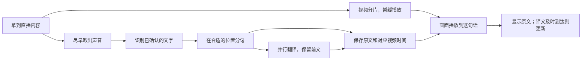

# 字幕逻辑与性能检查：15 秒延迟究竟在争取什么

后续进展：本文发现的问题已继续修复，具体改动、前后实测、音视频下载与卡顿恢复边界见[修复报告](stability-and-performance-fixes-2026-09-20.md)。本文保留修复前的检查记录。

检查日期：2026-09-20。依据是 `wip/subtitle-anchor-correction` 分支、`65efeb4` 提交上的当前工作树，包括尚未提交的识别服务内置翻译改动。本文记录源码检查、离线回放和本机实验，不代表已验证当前桌面进程或真实直播效果。

这轮的判断是：现有“画面晚播、字幕提前做”的方向合理。正常分句已经有历史回收，离线回放没有发现越用越慢；接下来最值得投入的是准确衡量译文能否赶上画面、减少不必要的等待，以及修整几个明确的资源增长点。

## 1. 从拿到直播到显示字幕

这是普通“识别后再单独翻译”的路径。识别服务直接返回译文时，中间的分句与翻译方式不同，见第 4 节。

### 画面晚播，声音尽早处理

项目给视频留出一段缓冲，让后台先听声音、出文字、做翻译。默认目标是 15 秒。当前实现将它拆为：后台分片发布约留 3 秒，播放器距离已发布内容的最前端约留 12 秒。分片、关键帧、下载波动和启动缓冲都会影响实际数值。

因此，15 秒是本地播放的目标延迟，不能当作“主播开口到观众看到一定只有 15 秒”的保证。上游直播平台本身有多少延迟，当前并没有实际测出来。

能够单独取音频的平台，后台会让音频和视频分别下载，较小的音频可以更早送去识别。混在一起的直播源，则从尚未延迟发布的视频分片里提取声音。视频主要是重新封装，并没有为了字幕把整路画面重新压制一遍。

### Soniox 边听边给文字，程序尽早接走已确认的部分

声音到达后就持续发送给识别服务，不等观众看到对应画面，也不再用过去的识别进度节流规则主动压住发送。

Soniox 返回的文字分为已经确认的部分和还可能改动的尾巴。程序可以提前使用已经确认的部分，不必等整段话结束；可能改动的尾巴暂不作为稳定字幕。日中韩文字会尽早交付；英语等语言还要避免把一个没完整出来的单词截断。

识别服务最后宣布这一段结束时，程序再核对并补齐尾部。已经发布的文字不能来回改写，也不能因最后收到整句就重复显示一遍。这是字幕稳定和尽早输出之间的重要约束。

### 分句是在“赶时间”和“讲完整”之间取舍

普通路径优先利用已经确认的标点和句子边界，并有规则避免切坏日语词组、小数、网址等。普通标点切分通常要求累计约 3 秒的语音，避免字幕碎成很短的小片；识别服务明确结束一段时可以例外。

此外有约 7 秒的待处理文字等待兜底。这个计时针对本地收到的稳定文字，不是从主播开口开始算，也不能迫使云端提前确认文字。一次返回一大段积压文字时，字幕对应的语音长度仍可能超过 7 秒。

所以，不能简单理解成“每 3 秒切一次”或“所有字幕必定小于 7 秒”。切得太碎，会增加请求次数、打断意思、让字幕跳得频繁；等得太久，前半句的画面可能已快要播到了。

### 翻译可以同时进行，不必一句堵住后面所有句子

当前默认允许同时处理 4 条翻译。每条字幕从入队开始默认有 6 秒总期限，排队也算在里面，并不是轮到它后重新获得完整的 6 秒。

翻译会参考近期前文，默认最多约 10 条、90 秒。前一句即使还没译完，后一句也能先参考它的原文继续处理，避免所有请求串行等待。积压时会减少上下文，条件满足时也可以使用备用服务。队列有上限，超时或被淘汰的翻译保留原文。

当前后台不再根据“估算的 15 秒还剩多少”提前拒绝一条翻译。启动时这个估计曾经把实际上还能赶上的字幕放弃了。后台现在限制自身处理时长，最终是否还值得上屏，交给知道真实播放位置的播放器判断。

### 字幕带着“对应哪段声音”的时间，到点再显示

字幕位置依据声音原来的时间，不依据“识别结果什么时候回来”。音频与视频分开下载时，程序优先使用来源携带的起点时钟差，把两者放到同一张时间表上。这样，先下载到的音频也不会简单地被当成与视频同时开始。

已确认的原文先进入字幕记录，译文完成后更新同一条记录。播放器前台现在每 0.25 秒取一次更新，每 0.1 秒检查该显示哪些字幕；轮询请求仍然串行，不会重叠。记录按序号增量获取，并有保留时间和数量限制。

到这句话的播放时间时，有译文就显示译文；译文还在等待，也允许先显示原文。译文在显示窗口内回来后再补上。轻微迟到可以补显示，严重迟到则跳过，避免观众看到画面已经过去很久的旧句子。下一句话会接管显示，真正同时说话的情况可以多行呈现。Provider 自带翻译时，完整标点句也会先按普通实时分句发布原文；如果后来发现它只是更长 Provider 段落的一部分，就保留原文，不猜测半句译文，只有原文与完整 Provider 段落一致时才补上整句译文。

当前画面字幕还固定提前约 0.15 秒，用于显示补偿；侧边字幕列表没有同样的提前量。这只改变显示时刻，不会加快识别或翻译。既然当前观感基本满意，应先做有声音参照的对比，再决定是否调整这 0.15 秒。

## 2. 为什么翻译只花两秒，也可能赶不上

一条字幕通常要在这段语音的开头就能显示，但要翻好它，往往需要先听到后面的词。这段话本身的长度也在消耗提前处理的时间。

举一个仅用于解释的例子：假设音频及时到达，播放缓冲已经稳定建立；一句话说了 4 秒，收尾确认和切分再用 1 秒，翻译排队与请求共 2 秒，传到播放器再留 0.5 秒。从句首到译文可用，大约是 7.5 秒。若对应画面在 15 秒后才播，就还有约 7.5 秒余量。

如果前面这句话连续说了 12 秒才切出来，同样的后续耗时就会使总时间变成 15.5 秒。翻译服务本身并没有变慢，译文依然可能赶不上句首。

实际处理是边听边进行的，各环节并不总是严格相加；上面的数字不是实测。它要说明的是：决定字幕能否准时的，不只是翻译接口耗时，还有音频到达、文字确认和什么时候愿意切句。

## 3. 当前最值得做的优化

### 优先把“准时率”量准

后台已经分别记录原文就绪、翻译成功和处理结束的耗时，但前台的字幕预算提示还在读取兼容字段 `readyLagP95`。这个字段实际包含失败、放弃等终态，并不等于“95% 的译文成功准备好所需时间”。

当前预算提示还把字幕时长和准备耗时各自的 95 分位相加。它可作为粗略提示，但两个不同统计集合的分位数相加，不能解释成严格的 95% 准时保证。音频结束时刻又带有依据解码进度估算的部分，启动和突发下载时会偏。

建议利用每条字幕的同一个身份和视频时间，记录：

- 原文、译文分别在播放到句首前几秒到达；没赶上时迟了多少。
- 实际上屏的是原文还是译文，是否在原文显示期间升级为译文。
- 没显示是因为没有译文、翻译超时、到达过晚，还是观众切换了视频或主动跳转。
- 把启动阶段、稳定播放、网络恢复分开统计，暂停和跳转不混入正常准时率。

这不是再做一轮界面美化，而是让后续参数调整有可靠依据。现有“迟到字幕”统计也不能代替译文准时率：原文已经准时显示过，译文后来才到，并不一定会被记录成一条新的迟到字幕。

### 用同一批声音比较分句方案

先保留当前方案作为对照，选短句、长句、日语句尾才交代意思、多人插话等样本，比较切分等待、译文质量、字幕跳动和请求数量。只看“平均更快”容易错过少量拖得很久的句子。

优先处理已经有可靠标点却还在等的情况。不要直接按字符数或固定一两秒强切；也不要仅凭估算的剩余缓冲重新提前丢弃翻译。是否缩短 3 秒切分门槛或 7 秒等待兜底，应由这批对照结果决定。

### 复用翻译连接，减少反复建立连接的开销

共享翻译请求函数每次都创建并关闭一个网络会话。本轮向本机测试服务连续发 12 次请求，观察到 12 条独立连接，确认当前没有跨请求复用。

可以改为在一次观看会话内复用连接，同时明确停止、切换服务和异常时的关闭逻辑，保持每条请求自己的期限和鉴权信息。这不会提高模型生成速度，但有望减少重复连接和加密握手的等待。本机实验没有测远程加密连接收益，不能承诺节省多少秒。

### 修整 Soniox 极长未结束段落的重复计算

即使先前的文字已分批交给下游，Soniox 适配层仍保留本段的全部已确认文字。每次收到消息，它都会重新拼整段文本、重新整理词片段和统计语言等信息，连没有新文字的消息也会做这项工作。

本轮让同一段一直不结束，每个规模测 8 次空消息，得到以下本机中位耗时：

| 当前段保留的文字碎片数 | 处理一条没有新文字的消息 |
| ---: | ---: |
| 100 | 1.664 毫秒 |
| 1,000 | 16.302 毫秒 |
| 5,000 | 88.338 毫秒 |
| 10,000 | 157.316 毫秒 |

该合成输入故意没有段落结束标记；收到结束标记后，保留数量回到 0。因此，这是长时间不分段时的风险，不能推断成普通直播看得越久必然越慢。毫秒数受本机负载影响，关键证据是重复处理量随着本段历史增长。

建议让适配层只处理新增加的已确认文字，复用已完成的统计，并保留最后的整句核对。不能简单删掉前面文字或强行改变识别段落，否则可能破坏去重、词边界和时间对应。

### 补齐其他服务的历史回收

本轮给 Speechmatics 和 AssemblyAI 适配器分别输入 10,000 个已结束段落，去重记录仍各有 10,000 条。它们会随句数增长，需要基于服务协议设计过期回收，保留足够的重传去重窗口。这个结果不表示当前 Soniox 路径受同样影响，也不证明整机已发生卡顿。

## 4. 识别服务直接给译文：旧快照中的两个具体问题

当前工作树已接入 Soniox / Qwen 等服务直接输出译文的方式。这种模式不用另发一次独立翻译请求，可能更省时间；实际速度与质量仍需用同一段声音比较。

**第一，切开的原文与译文不一定对应。** 在本文对应的旧快照中，这条路径关闭了普通的标点再分句，并用原文字数比例分配长段译文；不同语言的语序和长度不同，比例相等并不说明意思对应。比如日语的否定可能到句尾才出现，按比例取出的前半句译文并不能保证完整准确。随后已改为恢复普通实时分句：完整句子可以先发布原文，只有原文与完整 Provider 段落一致时才附加整句译文，中间切开的字幕保留原文而不猜译文。

这里应优先明确服务提供的原文、译文对应单位；缺少对应信息时，需要验证完整段落输出与长段切分的取舍。现有“译文没有丢字、没有重复”的测试，不能证明每条原文都配上了正确的那部分译文。

**第二，历史记录的 256 条目标上限并没有覆盖所有路径。** 回收目前只在更新中的段落写入时触发，且只删除已关闭、已消费过译文的记录。只收到最终结果，或持续没有译文的段落，都可能越存越多。

本轮用当前实现输入 1,000 个已结束段落：仅最终结果无译文、写入后结束但无译文、仅最终结果且译文已消费，三种情况最后都保留了 1,000 条记录。第三种情况待消费数量为 0，但记录仍未回收。

这是旧快照中复现的资源回收缺口。当前 `NativeTranslationBus` 已对完成、失败、超时、队列淘汰和断线重建统一回收，并保护仍在等待译文的条目；仍需在真实 Provider 会话中验收长段翻译对应关系。

## 5. 已经有效的工作与本轮验证

本轮没有把旧审计里的问题直接当成当前缺陷。当前代码已有正常分句历史回收、队列上限、解码日志持续读取、轮询防重入、请求正文超时、翻译结束后的清理，以及来源时间回绕处理。

| 检查 | 当前结果 | 能说明什么 |
| --- | --- | --- |
| 相当于 8 小时、6,545 句的正常分句压缩回放 | 单句批次处理约 0.2～0.3 毫秒，未随回放时间持续上涨 | 在该输入规模下，正常分句未重现旧的历史累积退化 |
| 相当于 5 小时、4,090 句的流水线压缩回放 | 队列、处理中信息和字幕记录有界；热切换后的待清理信息归零 | 在假翻译服务和突发输入下检查资源回收，不代表真实成功率 |
| Soniox 无段落结束的合成输入 | 旧段落越长，空消息处理越慢；结束后清空 | 条件性重复计算问题仍存在 |
| 本机翻译请求 | 12 次请求建立 12 条连接 | 当前无跨请求连接复用；未测远程收益 |
| 内置翻译记录 | 三种完成路径各输入 1,000 段，均保留 1,000 段 | 256 条目标上限并不可靠 |
| Python 相关回归 | 9 个文件、199 项通过 | 覆盖分句、Soniox、翻译期限、字幕流水线、内置翻译和时间回绕 |
| 播放器相关回归 | 36 项通过 | 覆盖字幕选择、轮询和请求超时 |

长时回放是把数小时规模的合成消息压缩送入程序，不是实际连续看了数小时直播。极端突发回放中的队列淘汰数量不能换算成真实直播失败率。显示选择的本地微基准也没有包含视频解码、页面绘制和显卡开销，因此本报告不对整机 CPU、GPU 或真实播放流畅度作结论。

本轮共 235 项相关回归通过。没有调用收费识别或翻译服务，也没有做同场真实直播的译文准时率测试。测试通过与上述新发现并不矛盾：已有用例没有覆盖这些历史增长和跨语言对应关系。

建议实施顺序是：修复内置翻译记录回收等确定的资源问题；补齐逐条字幕的实际播放测量；复用翻译连接、减少 Soniox 重复计算；最后用同一批声音比较分句参数和翻译方案。原生译文的对应关系应作为该模式单独的验收条件。

本轮新增本文和本地离线检查记录，没有修改字幕实现或调整现有延迟参数。此前的开源准备变更与尚未提交的业务代码保持在原工作树中。

## 6. 代码和证据入口

- 播放延迟、双路下载、内置翻译选择、来源时间：[server.py](../prototype/hls-companion/companion/server.py)，重点看 `_publisher_delay`、`_prepare_subtitles`、`_asr_audio_leg_selector`、`_source_clock_offset`。
- 音频发送、识别事件、并行翻译、统计：[subtitle_pipeline.py](../prototype/hls-companion/companion/subtitle_pipeline.py)，重点看 `_pcm_sender`、`_handle_asr_event`、`_translation_worker`、`_record_ready_lag`。
- 分句与等待：[caption_chunker.py](../prototype/hls-companion/companion/caption_chunker.py)、[punctuation_boundaries.py](../prototype/hls-companion/companion/punctuation_boundaries.py)。
- 翻译总期限：[translation_budget.py](../prototype/hls-companion/companion/translation_budget.py)；上下文：[context_manager.py](../prototype/hls-companion/companion/context_manager.py)。
- Soniox 增量处理：[asr_soniox_realtime.py](../prototype/hls-companion/companion/providers/asr_soniox_realtime.py) 的 `_map_event`。
- 网络连接：[http.py](../prototype/hls-companion/companion/providers/http.py) 的 `post_json`。
- 内置译文的对应和回收：[native_session.py](../prototype/hls-companion/companion/providers/native_session.py) 的 `_take`、`close_item`、`_reclaim`。
- 显示时刻与预算提示：[player.js](../prototype/hls-companion/web-player/player.js) 的 `updateSubtitleBudget`、`renderSubtitle`；[subtitle-scheduler.js](../prototype/hls-companion/web-player/subtitle-scheduler.js) 的 `active`。

本地检查记录位于忽略目录 `.scratch/subtitle-performance-20260920/`，包含实验结果、当前关键源码的 SHA-256、逐项测试日志和命令。运行脚本为 `.scratch/subtitle-performance-probe-20260920.py`、`.scratch/subtitle-performance-tests-20260920.py`；长时规模回放沿用 `.scratch/laglingo-audit/` 的现有脚本。这些本机记录不属于公开文档依赖。
